# Personal Portfolio Website

Welcome to my personal portfolio! This website showcases my projects, skills, and interests as a developer and designer. Explore the site to see screenshots and details of various works, from web development to data science and more.

## 🌐 Live Demo

https://irumshehryar.github.io/portfolio/


## 📁 Project Structure

- `index.html` — Main website HTML
- `styles.css` — Custom CSS styling
- `assets/screenshots/` — Project and design screenshots featured in the portfolio

## 🖼️ Portfolio Screenshots

A sample of projects represented in this portfolio:

| Name         | Preview                                  |
|--------------|------------------------------------------|
| Cooking      | 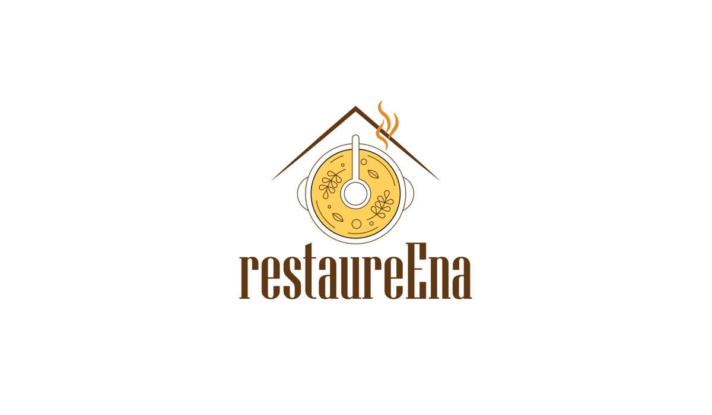      |
| Design       | 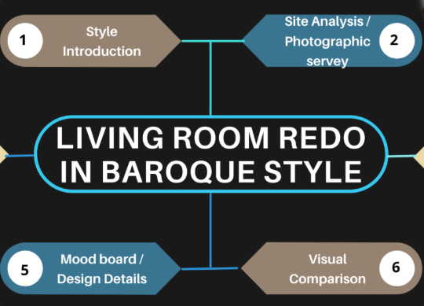       |
| Design (alt) | 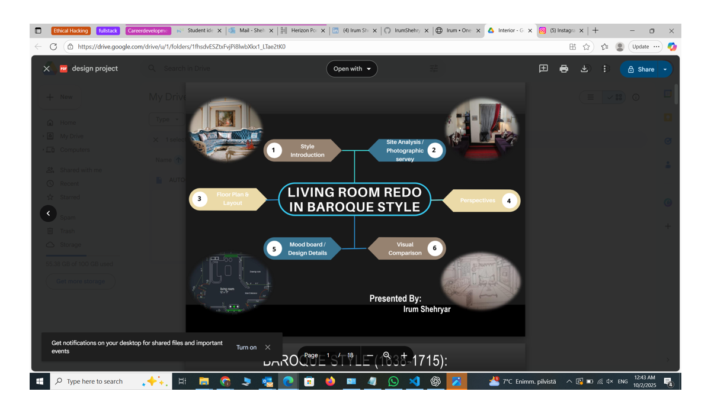      |
| Diabetes     | 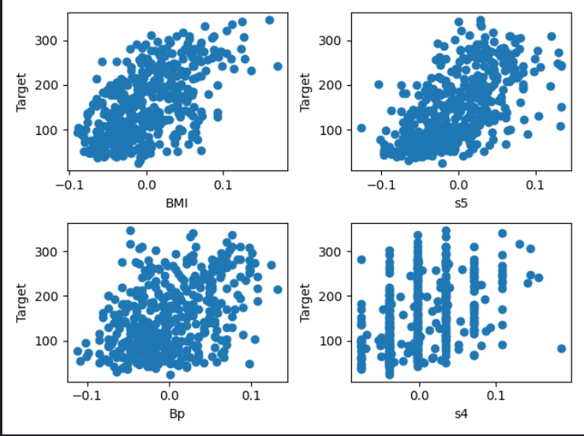     |
| Hero         |          |
| Iris         | 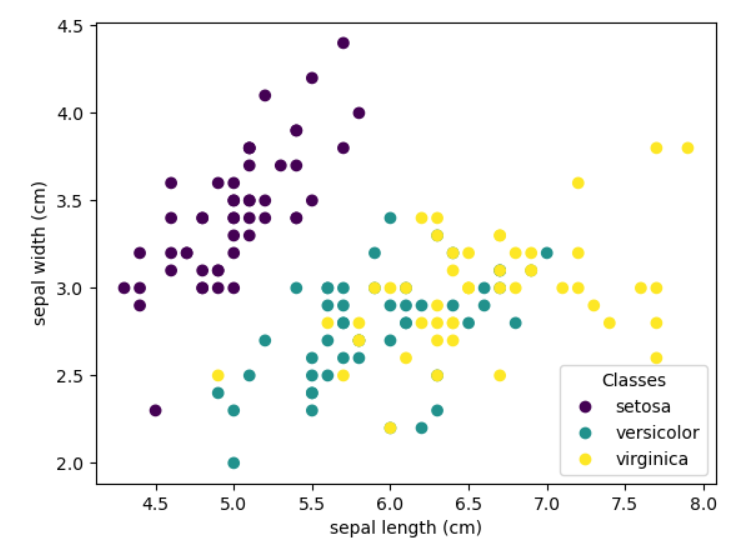         |
| JavaScript   | 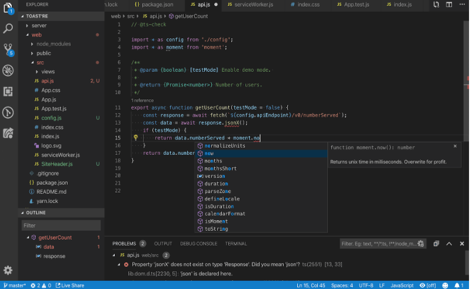   |
| Lost         | 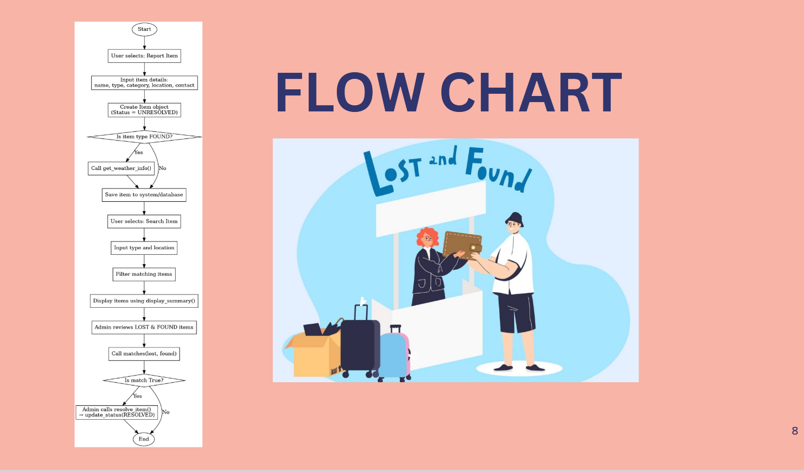         |
| MCP          | 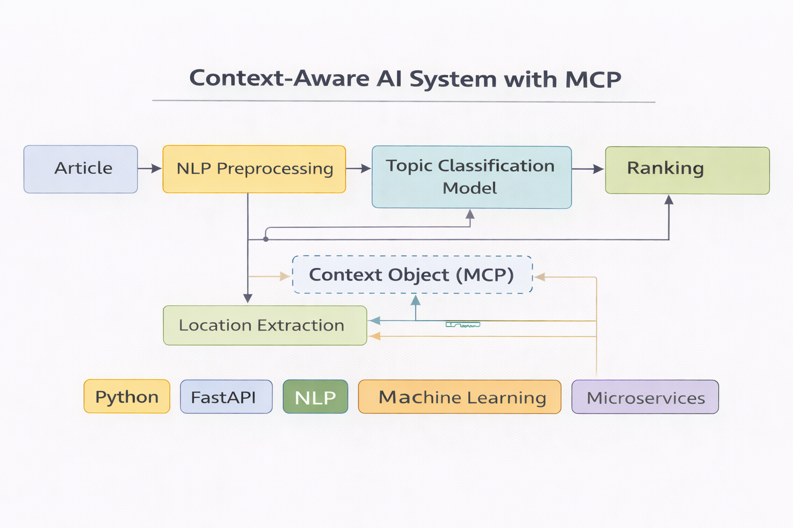          |
| Mentor       | 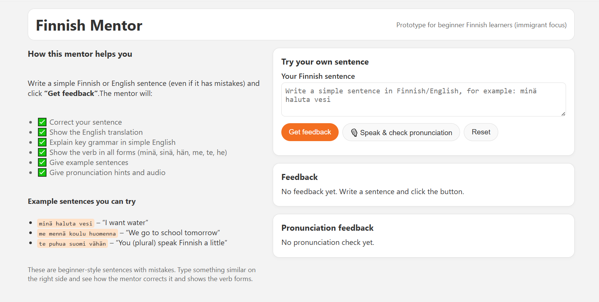       |
| Microservice | 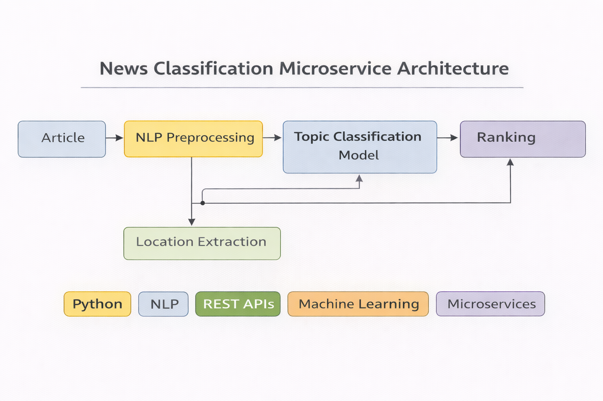 |
| OWASP        | 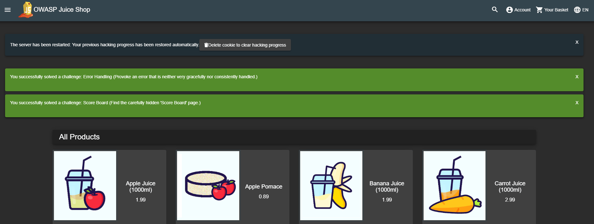        |
| PacketTracer | 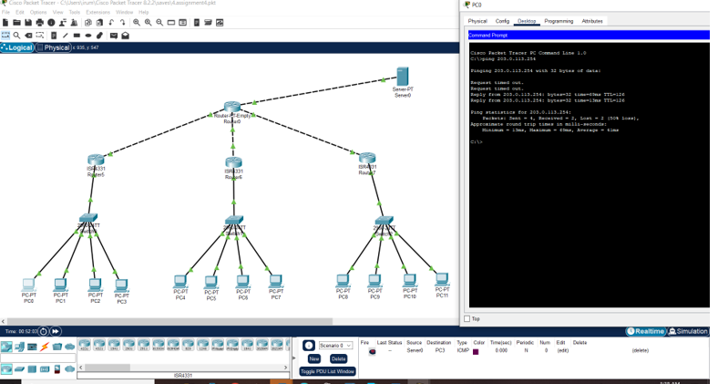 |
| VOIP         | 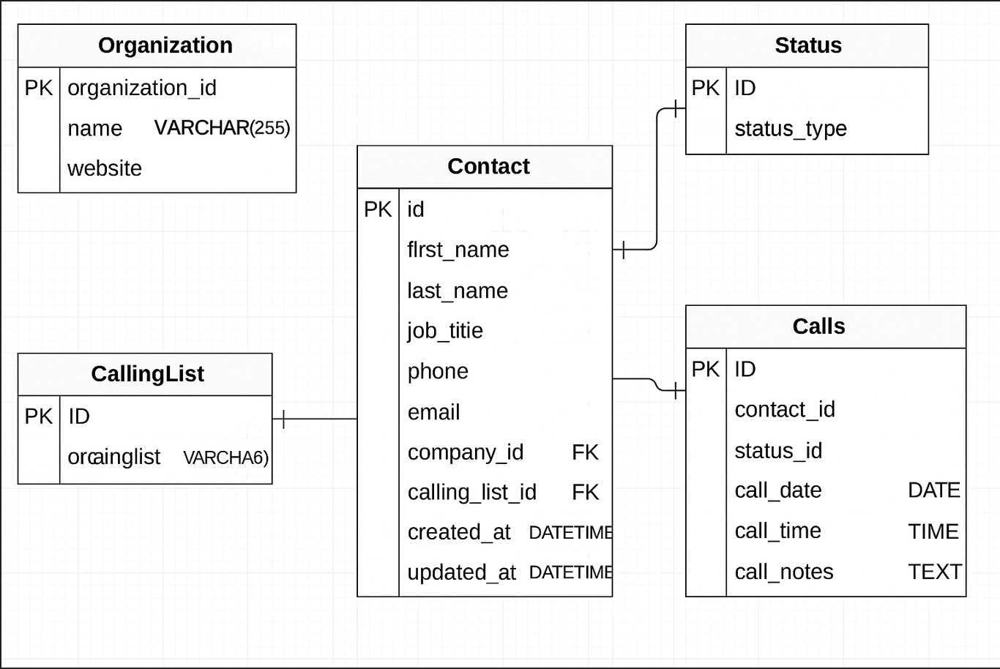         |
| Website      | 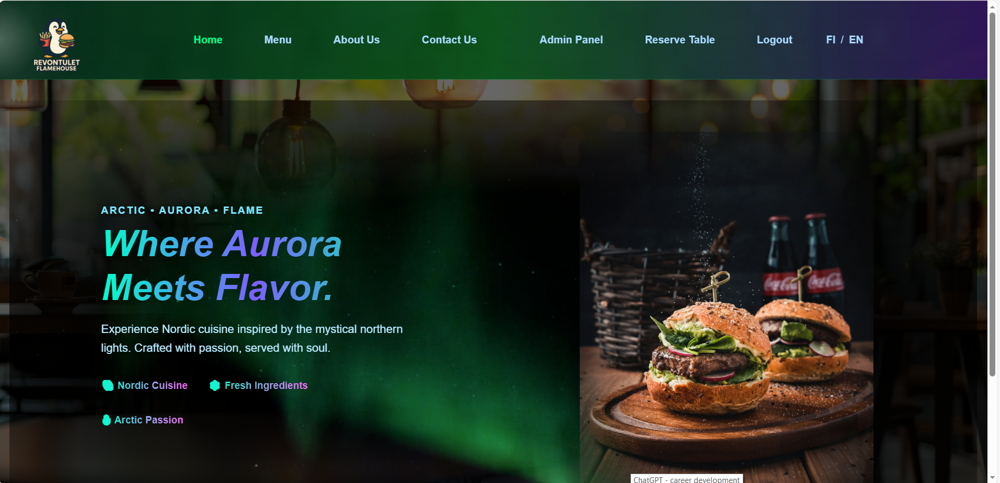      |
| Website Alt  | 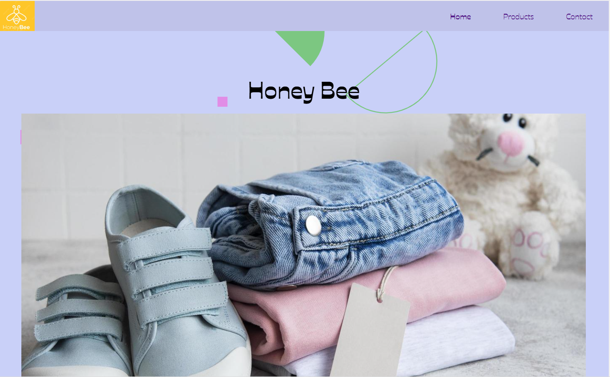      |


## 🚀 Features

- Responsive HTML + CSS design
- Visual project/gallery section
- Easy to update with new projects or images

## 🛠️ How to Use

1. Clone this repository:
   ```bash
   git clone https://github.com

