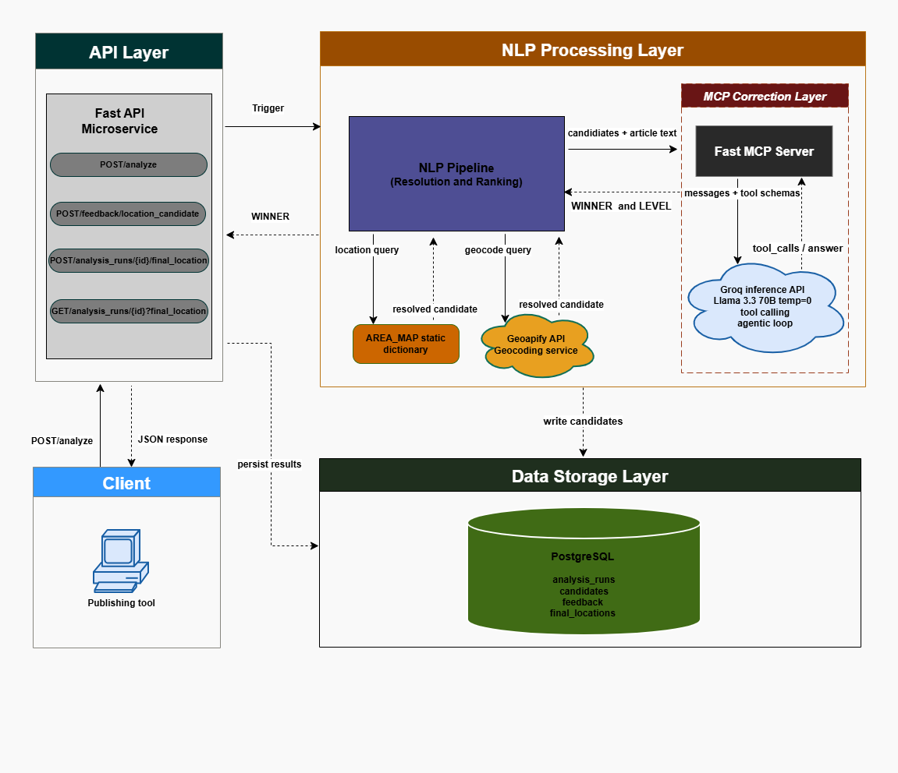
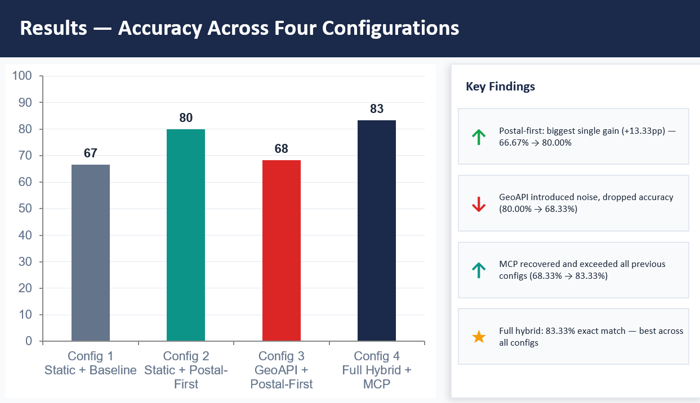
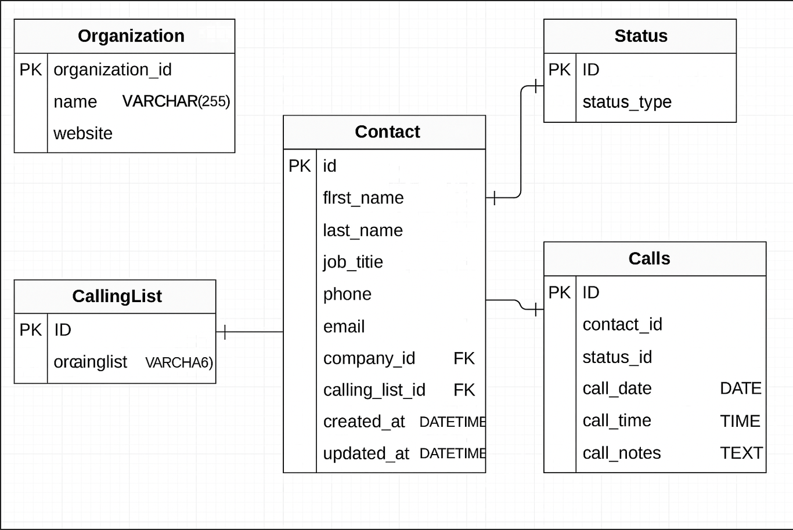
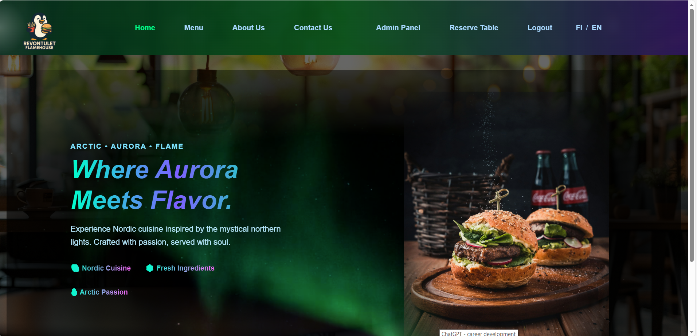
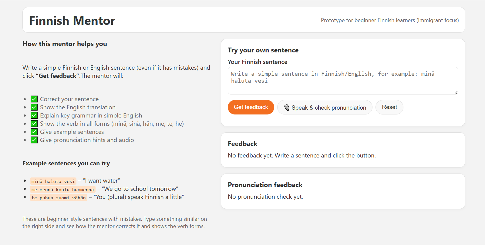
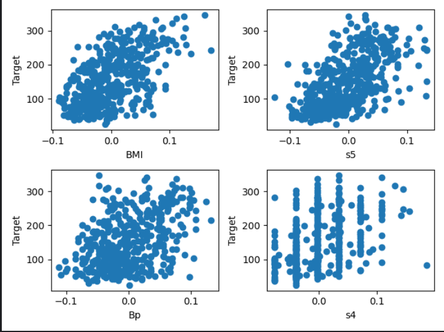

# Personal Portfolio Webpage

Welcome to my personal portfolio! This website showcases my projects, skills, and interests as a developer and designer. Explore the site to see screenshots and details of various works, from web development to machine learning.

## 🌐 Live Demo

https://irumshehryar.github.io/portfolio/


## 📁 Project Structure

- `index.html` — Main website HTML
- `styles.css` — Custom CSS styling
- `assets/screenshots/` — Project and design screenshots featured in the portfolio

## 🖼️ Portfolio Screenshots

A sample of projects represented in this portfolio:

| Name                      | Preview                                           |
|---------------------------|---------------------------------------------------|
| Hero                      |                   |
| System Architecture       |    |
| Results Graph             |          |
| VoIP Backend              |                   |
| Full-Stack Restaurant     |                |
| Finnish Tutor Assignment  |                 |
| ML Experiments - Diabetes |               |


## 🚀 Features

- Responsive HTML + CSS design
- Visual project/gallery section
- Easy to update with new projects or images

## 🛠️ How to Use

1. Clone this repository:
   ```bash
   git clone https://github.com/IrumShehryar/portfolio.git
   cd portfolio
   ```

2. Open `index.html` in your browser to view the portfolio locally.

3. To add new projects:
   - Add screenshot images to `assets/screenshots/`
   - Update the portfolio screenshots table in this README
   - Update the HTML to include the new project in your portfolio page

## 📝 License

This portfolio is open source and available under the MIT License.
